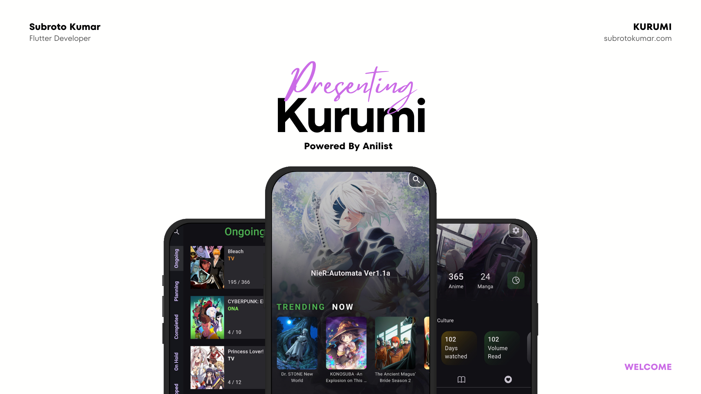

 

# Kurumi - Unofficial Anilist Client

Kurumi is an unofficial anilist client application. Are you tired of getting lost in the vast world of anime and manga? Look no further than our ultimate anime and manga discovery and tracking app! 

Kurumi is available on the Google Play Store.

  
<!-- 
        
 -->

## About

With our user-friendly interface, you'll be able to easily browse through an extensive collection of anime and manga titles, from timeless classics to the latest releases. Our app offers personalized tracking, so you'll never miss a beat. Keep track of what you're currently watching or reading, and create a custom list of your favorite shows and manga series. No more confusion about what you've seen or what you need to watch next - our app will guide you every step of the way.

But that's not all. Our app also features comprehensive information on each anime and manga title, including detailed synopses, ratings, and reviews from other anime and manga enthusiasts. You'll always be in the know about the hottest new releases and the must-see classics.

Whether you're a seasoned anime and manga fan or just starting out, our app is the ultimate tool for all your tracking and discovery needs. So what are you waiting for? Download our app today and embark on a new world of anime and manga discovery!

## Features

The android app lets you:

- Supports Android 4.3 or up.
- Completely ad-free.

## Screenshots

&nbsp;&nbsp;&nbsp;&nbsp;&nbsp;&nbsp;

## Permissions

On Android versions prior to Android 6.0, Kurumi requires the following permissions:
- Full Network Access.
- View Network Connections.
<!-- - Run at startup. -->
- Read and write access to external storage.

The "Run at startup" permission is only used if Auto-Sync feature is enabled and is not utilised otherwise. The network access permissions are made use of for downloading content. The external storage permission is used to cache article images for viewing offline.

## Contributing

Kurumi app is a free and open source project developed by [subrotokumar](https://www.github.com/subrotokumar). Any contributions are welcome. Here are a few ways you can help:
 * [Report bugs and make suggestions.](https://github.com/subrotokumar/kurumi/issues)

## License

This application is released under GNU GPLv3 (see [LICENSE](LICENSE)).
Some of the used libraries are released under different licenses.